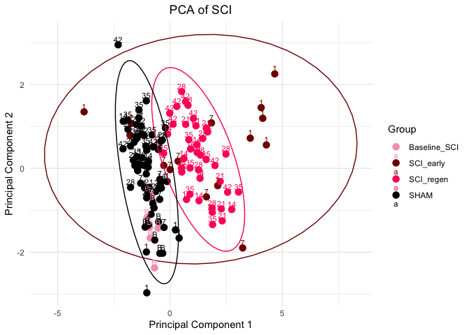
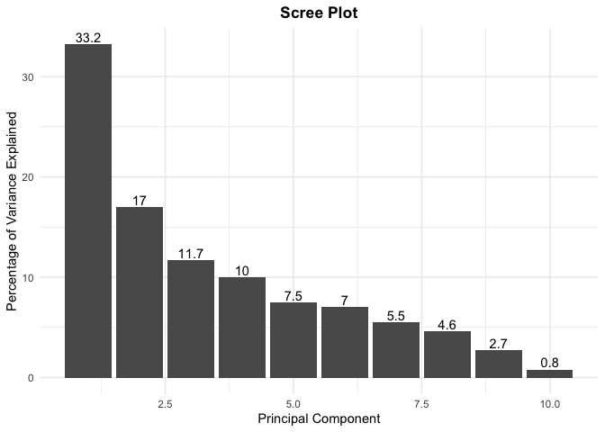
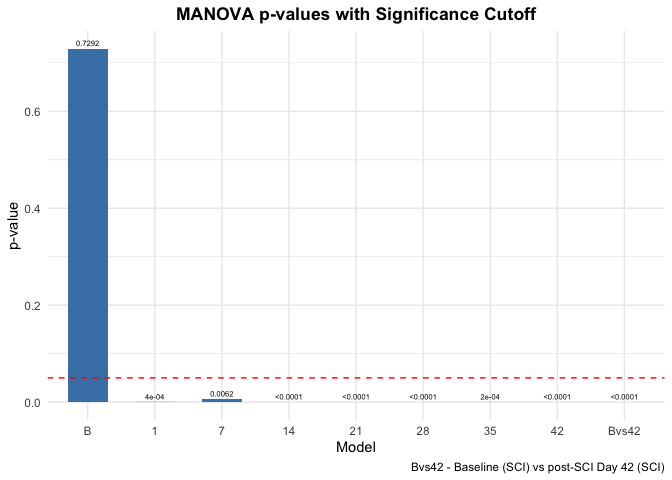

PCA Analysis with MANOVA
================

## Load Libraries

``` r
library(readxl)
library(ggplot2)
library(rgl)
```

## Import and Preprocess Data

##### Features: Front Paws Distance (pixel), Hind Paws Distance (pixel)“, Distance Traveled (pixel), Femur Width (pixel), LHP Paw Angle (degree), RHP Paw Angle (degree)

``` r
# set working directory to contain 'BlackBox Summary Data.xlsx' before running below
data <- as.data.frame(read_xlsx('BlackBox Summary Data.xlsx'))
rownames(data) <- data[,1]
data <- data[,-1]

features <- c("front_paws_distance (pixel)",
              "hind_paws_distance (pixel)",
              "distance_traveled (pixel)",
              "femur_width (pixel)",
              "LHP_paw-angle (degree)",
              "RHP_paw-angle (degree)")
features <- features[features %in% colnames(data)]
print(features)
```

    ## [1] "front_paws_distance (pixel)" "hind_paws_distance (pixel)" 
    ## [3] "distance_traveled (pixel)"   "femur_width (pixel)"        
    ## [5] "LHP_paw-angle (degree)"      "RHP_paw-angle (degree)"

``` r
pca_data <- data[, features]

pca <- prcomp(pca_data, scale=TRUE)
pca_data <- na.omit(pca_data)
pca_df <- as.data.frame(pca$x)

# Make group (SCI or SHAM) factor
model <- factor(rep(c("SCI","SHAM"), each = 64, length.out = 128))

group <- factor(c(rep("Baseline_SCI", 8),
                  rep("SCI_1", 8),
                  rep("SCI_7", 8),
                  rep("SCI_14", 8),
                  rep("SCI_21", 8),
                  rep("SCI_28", 8),
                  rep("SCI_35", 8),
                  rep("SCI_42", 8),
                  rep("Baseline_SHAM", 8),
                  rep("SHAM_1", 8),
                  rep("SHAM_7", 8),
                  rep("SHAM_14", 8),
                  rep("SHAM_21", 8),
                  rep("SHAM_28", 8),
                  rep("SHAM_35", 8),
                  rep("SHAM_42", 8)))
                  
custom_colors <- c(
  "Baseline_SCI" = "#67001f",
  "SCI_1" = "#ff0000",
  "SCI_7" = "#ff6d00",
  "SCI_14" = "#ff66b2",
  "SCI_21" = "#b23dc6",
  "SCI_28" = "#6b5bd6",
  "SCI_35" = "#2b69d1",
  "SCI_42" = "#002b88",
  
  "Baseline_SHAM" = "#000000",
  "SHAM_1" = "#000000",
  "SHAM_7" = "#000000",
  "SHAM_14" = "#000000",
  "SHAM_21" = "#000000",
  "SHAM_28" = "#000000",
  "SHAM_35" = "#000000",
  "SHAM_42" = "#000000"
)

pca_df$Group <- group
pca_df$Model <- model
Sample <- rep(c("BL",1, 7, 14, 21, 28, 35, 42), each = 8, length.out = 128)
pca_df$Sample <- Sample
```

## PCA Plot

``` r
pca_plot <- function() {
  SCI_early_df <<- pca_df[pca_df$Group %in% c("SCI_1", "SCI_7"),]
  SCI_regen_df <<- pca_df[pca_df$Group %in% c("SCI_14", "SCI_21", "SCI_28", "SCI_35", "SCI_42"),]
  SHAM_df <<- pca_df[pca_df$Model == "SHAM",]
  
  # Create the 2D PCA plot
  return(
    ggplot(pca_df, aes(x = PC1, y = PC2, color = Group)) +
    geom_point(size = 3) +
    stat_ellipse(data = SCI_regen_df, aes(x = PC1, y = PC2), type = "norm", level = 0.95, color = custom_colors[['SCI_42']]) +
    stat_ellipse(data = SHAM_df, aes(x = PC1, y = PC2), type = "norm", level = 0.95, color = custom_colors[['SHAM_1']]) +
    geom_text(data =, aes(label = Sample), vjust = -0.5, size = 3) +
    labs(title = "Significant Features Principal Component Analysis",
         x = "Principal Component 1",
         y = "Principal Component 2") +
    scale_color_manual(values = custom_colors) +
    scale_fill_manual(values = custom_colors) +
    theme_minimal() +
    theme(plot.title = element_text(hjust = 0.5))
  )
}

print(pca_plot())
```

<!-- -->

## Top 5 Variables Contributing to PC1

``` r
get_top_5 <- function () {
  loading_scores <- pca$rotation[,1]
  gene_scores <- abs(loading_scores) ## get the magnitudes
  gene_score_ranked <- sort(gene_scores, decreasing=TRUE)
  top_5_variables <- names(gene_score_ranked[1:5])
  top_5_variables
  pca$rotation[top_5_variables,1]
}

get_top_5()
```

    ##  hind_paws_distance (pixel)      RHP_paw-angle (degree) 
    ##                  -0.5246595                  -0.4986210 
    ##      LHP_paw-angle (degree)         femur_width (pixel) 
    ##                  -0.4868283                  -0.3397927 
    ## front_paws_distance (pixel) 
    ##                   0.2694476

## Scree Plot

``` r
scree_plot <- function() {
  # Calculate the percentage of variance explained by each principal component
  pca.var <- pca$sdev^2
  pca.var.per <- round(pca.var / sum(pca.var) * 100, 1)
  
  # Create a data frame for plotting
  pca.var.per.df <- data.frame(
    Number = seq_along(pca.var.per),
    Variance = pca.var.per
  )
  
  # Create the scree plot
  ggplot(data = pca.var.per.df, aes(x = Number, y = Variance)) +
    geom_bar(stat = "identity") +
    geom_text(aes(label = Variance), position = position_dodge(width = 0.9), vjust = -0.25) +
    labs(x = "Principal Component", y = "Percentage of Variance Explained") +
    ggtitle("Scree Plot") +
    theme_minimal() +
    theme(plot.title = element_text(hjust = 0.5))
}

scree_plot()
```

<!-- -->

## MANOVA Analysis

``` r
manova_analysis <- function() {
  manova_tests <- function() {
    manova_models <- list()
    
    for (sample in unique(pca_df$Sample)) {
      model <- manova(cbind(PC1, PC2) ~ Model,
                      data = pca_df[pca_df$Sample == sample, ])
      manova_models[[sample]] <- model
    }
    
    return(manova_models)
  }
  
  manova_models_list <- manova_tests()
  manova_models_list[["BLvs42"]] <-
    manova(cbind(PC1, PC2) ~ Sample, data = pca_df[
      (pca_df$Sample == "BL" & pca_df$Model == "SCI") |
        (pca_df$Sample == "42" & pca_df$Model == "SCI"),
    ])
  
  manova_pvals_df <- data.frame(
    model = character(),
    p_value = numeric()
  )
  
  for (model_name in names(manova_models_list)) {
    manova_summary <- summary(manova_models_list[[model_name]])
    p_value <- manova_summary$stats[1, "Pr(>F)"]
    manova_pvals_df <- rbind(manova_pvals_df, data.frame(model = model_name, p_value = p_value))
  }
  
  manova_pvals_df$model <- factor(
    manova_pvals_df$model,
    levels = c("BL", "1", "7", "14", "21", "28", "35", "42", "BLvs42")
  )
  
  manova_pvals_df$label <- lapply(manova_pvals_df$p_value, function(pval) {
    if(pval < 0.0001) "<0.0001" else round(pval, digits=4)
  })

  assign("manova_pvals_df", manova_pvals_df, envir=.GlobalEnv)
  
  ggplot(manova_pvals_df, aes(x = model, y = p_value)) +
    geom_bar(stat = "identity", fill = "steelblue", width = 0.6) +
    geom_hline(yintercept = 0.05, linetype = "dashed", color = "red") +
    geom_text(aes(label = label), vjust = -0.5, color = "black", size = 2) +
    labs(
      x = "Model",
      y = "p-value",
      title = "MANOVA p-values with Significance Cutoff",
      caption = "BLvs42 - Baseline (SCI) vs post-SCI Day 42 (SCI)") +
    theme_minimal() +
    theme(plot.title = element_text(face="bold", hjust = 0.5))
}

manova_analysis()
```

<!-- -->
