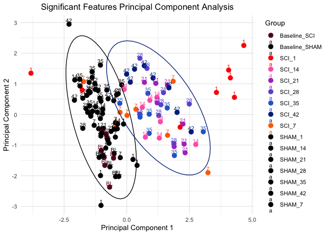
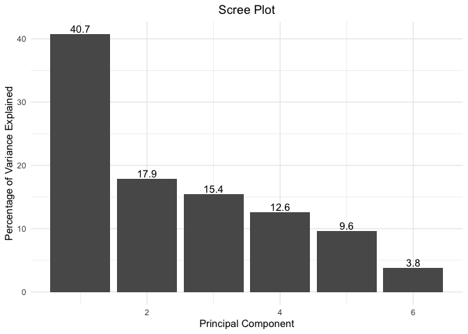

PCA Analysis with MANOVA
================

## Load Libraries

``` r
library(readxl)
library(ggplot2)
library(rgl)
```

## Import and Preprocess Data

##### Features: Front Paws Distance (Pixel), Hind Paws Distance (Pixel), Ankle Distance (Pixel), Hip Width (Pixel), Hind Left Paw Angle (Degree), Hind Right Paw Angle (Degree), Distance Traveled (Pixel), Acceleration Variability (Standard Deviation), Empty Bins Count, Front to Hind Paw Speed Ratio

``` r
# set working directory to contain 'Blackbox_Consolidated_Data.xlsx'
data <- as.data.frame(read_xlsx('Blackbox_Consolidated_Data.xlsx'))
rownames(data) <- data[,1]
data <- data[,-1]

features <- c("front_paws_distance (pixel)",    "hind_paws_distance (pixel)",   "ankle_distance (pixel)",   "hip_width (pixel)",    "hind_left_paw_angle (degree)", "hind_right_paw_angle (degree)",    "distance_traveled (pixel)",    "acceleration_variability (standard deviation)",    "empty_bins_counts", "fthp_spd_avgs")
features <- features[features %in% colnames(data)]
pca_data <- data[, features]

pca <- prcomp(pca_data, scale=TRUE)
pca_data <- na.omit(pca_data)
pca_df <- as.data.frame(pca$x)

# Make group (SCI or SHAM) factor
group <- factor(rep(c("SCI","SHAM"), each = 64, length.out = 128))

custom_colors <- c("SCI" = "#1f77b4", "SHAM" = "#ff7f0e")

pca_df$Group <- group
Sample <- rep(c("B",1, 7, 14, 21, 28, 35, 42), each = 8, length.out = 128)
pca_df$Sample <- Sample
```

## PCA Plot

``` r
pca_plot <- function() {
  # Filter data for SCI days 21-42
  regen_days <- c(21, 28, 35, 42)
  early_days <- 1
  
  sci_regen_df <<- pca_df[pca_df$Group == "SCI" & pca_df$Sample %in% regen_days,]
  SHAM_df <<- pca_df[pca_df$Group == "SHAM",]
  SCI_df <<- pca_df[pca_df$Group == "SCI",]
  early_SCI_df <<- pca_df[pca_df$Group == "SCI" & pca_df$Sample %in% early_days,]
  
  # Create the 2D PCA plot
  return(
    ggplot(pca_df, aes(x = PC1, y = PC2, color = Group)) +
    geom_point(size = 3) +
    stat_ellipse(data = sci_regen_df, aes(x = PC1, y = PC2), type = "norm", level = 0.95, color = "blue") +
    stat_ellipse(data = early_SCI_df, aes(x = PC1, y = PC2), type = "norm", level = 0.95, color = "green") +
    stat_ellipse(data = SHAM_df, aes(x = PC1, y = PC2), type = "norm", level = 0.95, color = "orange") +
    labs(title = "PCA of SCI",
         x = "Principal Component 1",
         y = "Principal Component 2") +
    scale_color_manual(values = custom_colors) +
    scale_fill_manual(values = custom_colors) +
    theme_minimal() +
    theme(plot.title = element_text(face="bold", hjust = 0.5)) +
    geom_text(data = SCI_df, aes(label = Sample), vjust = -0.5, size = 3)
  )
}

print(pca_plot())
```

<!-- -->

## Top 5 Variables Contributing to PC1

``` r
get_top_5 <- function () {
  loading_scores <- pca$rotation[,1]
  gene_scores <- abs(loading_scores) ## get the magnitudes
  gene_score_ranked <- sort(gene_scores, decreasing=TRUE)
  top_5_variables <- names(gene_score_ranked[1:5])
  top_5_variables ## show the names of the top 5 measurements
  pca$rotation[top_5_variables,1] ## show the scores (and +/- sign)
}

get_top_5()
```

    ##    hind_paws_distance (pixel)        ankle_distance (pixel) 
    ##                    -0.4640073                    -0.4549476 
    ## hind_right_paw_angle (degree)  hind_left_paw_angle (degree) 
    ##                    -0.4008954                    -0.3974044 
    ##             hip_width (pixel) 
    ##                    -0.3248327

## Scree Plot

``` r
scree_plot <- function(pca) {
  # Calculate the percentage of variance explained by each principal component
  pca.var <- pca$sdev^2
  pca.var.per <- round(pca.var / sum(pca.var) * 100, 1)
  
  # Create a data frame for plotting
  pca.var.per.df <- data.frame(
    Number = seq_along(pca.var.per),
    Variance = pca.var.per
  )
  
  # Create the scree plot
  ggplot(data = pca.var.per.df, aes(x = Number, y = Variance)) +
    geom_bar(stat = "identity") +
    geom_text(aes(label = Variance), position = position_dodge(width = 0.9), vjust = -0.25) +
    labs(x = "Principal Component", y = "Percentage of Variance Explained") +
    ggtitle("Scree Plot") +
    theme_minimal() +
    theme(plot.title = element_text(face="bold", hjust = 0.5))
}

scree_plot(pca)
```

<!-- -->

## MANOVA Analysis

``` r
manova_analysis <- function() {
  manova_tests <- function() {
  manova_models <- list()
  
  for (sample in unique(pca_df$Sample)) {
    model <- manova(cbind(PC1, PC2) ~ Group,
                    data = pca_df[pca_df$Sample == sample, ])
    manova_models[[sample]] <- model
  }
  
  return(manova_models)
}

manova_models_list <- manova_tests()
manova_models_list[["Bvs42"]] <-
  manova(cbind(PC1, PC2) ~ Group, data = pca_df[
  (pca_df$Sample == "B" & pca_df$Group == "SHAM") |
  (pca_df$Sample == "42" & pca_df$Group == "SCI"),
])

manova_pvals_df <- data.frame(
 model = character(),
 p_value = numeric()
)

for (model_name in names(manova_models_list)) {
  manova_summary <- summary(manova_models_list[[model_name]])
  p_value <- manova_summary$stats["Group", "Pr(>F)"]
  manova_pvals_df <- rbind(manova_pvals_df, data.frame(model = model_name, p_value = p_value))
}

manova_pvals_df$model <- factor(
  manova_pvals_df$model,
  levels = c("B", "1", "7", "14", "21", "28", "35", "42", "Bvs42")
)
manova_pvals_df$asterisk <- ifelse(manova_pvals_df$p_value < 0.05, "*", "")

ggplot(manova_pvals_df, aes(x = model, y = p_value)) +
  geom_bar(stat = "identity", fill = "steelblue", width = 0.6) +
  geom_hline(yintercept = 0.05, linetype = "dashed", color = "red") +
  geom_text(aes(label = asterisk), vjust = -0.5, color = "black", size = 5) +
  labs(
    x = "Model",
    y = "p-value",
    title = "MANOVA p-values with Significance Cutoff",
    caption =
    "* indicates statistical significance (p-value < 0.05)
    Bvs42 - Baseline (SHAM) vs post-SCI Day 42 (SCI)"
  ) +
  theme_minimal() +
  theme(plot.title = element_text(face="bold", hjust = 0.5))
}

manova_analysis()
```

<!-- -->
